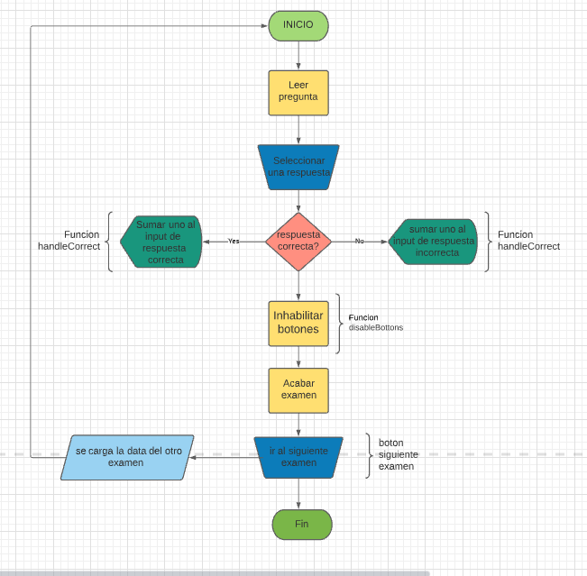

# sistema-evaluativo
Este es un sistema evaluativo que utiliza una fake API para cargar las evaluaciones

#  Jesus Alberto Garzon Castillo

## Diagrama de flujo




## 🛣️ App details
<details>
<summary>Funcionamiento de la aplicacion</summary>
<br>
Debes ingresar a la aplicacion completar el examen y se iran cargando tus aciertos y desaciertos en la parte superior, cuando finalices debes dar click al boton siguiente examen.

</details>

## URL

 [Prueba la APP aqui](https://616d957eecf01c000760c11d--cocky-hodgkin-e5e89d.netlify.app/)

<br>

<br>

## ⚒️ Set Up
### 🚚 API
this is the first step for the project to run. The API runs with json-server.


### 🛠️ Instalación
```
npm install
```

### 🏃 Ejecución
```
npm run start
```

### 💻 Server
```
npm run server
```

### 🧱 Compilar
```
npm run build
```

### ⚗️ Pruebas Unitarias
```
npm run test
```

### 🕵 ESlint
```
npm run lint
```

### Licencia
frontend se lanza bajo la licencia [MIT](https://opensource.org/licenses/MIT).
